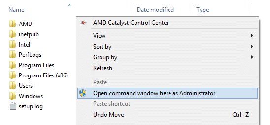
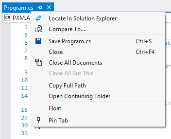
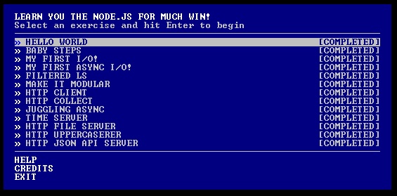

Admin Command Prompt for Windows 8 in the context menu

I can't believe I have gone so long without using something like this in my Windows OS. This [blog post from Michael Crump](http://michaelcrump.net/power-tip-elevated-command-prompt-here-in-windows-8-1) tells you everything you need to know.

Using this registry edit, you can open a Command Prompt with Admin privileges from any folder by right-clicking on the File Explorer. This creates a handy shortcut that can be launched anywhere in the File Explorer.

<!--more-->

VSCommands for Visual Studio

A colleague of mine told me about this [Visual Studio extension](http://vscommands.squaredinfinity.com) some time ago. It provides some very useful features and tools to enhance your Visual Studio productivity.

My three favorite commands from this extension are:

+ Attach to IIS: displays a dialog window in Visual Studio with the available IIS websites you can attach your code to.

+ Locate in Solution Explorer: shows the location of a file in the editor on the Solution Explorer.

+ Locate in TFS: finds the location of a file in the editor (or the Solution Explorer) on the Source Control Explorer.

Node School

In the past few months I have become quite interested in Node. One of the first things I did was to visit [NodeSchool](http://nodeschool.io) and check out which tutorials I could use to get started.

One of the tutorials I came across was [LearnYouNode](https://github.com/rvagg/learnyounode). I completed all the exercises recently and I have to say I really liked how it is set up as a learning tool. In a few short sessions you can a get good overview of how Node works.

Also, while completing the exercises I came across this GitHub repo: [ArtOfNode](https://github.com/maxogden/art-of-node)

I do not remember how I found this link while I was doing the tutorial. Nevertheless, the information presented in the document provides some good background details about the core Node concepts.

This is a very good resource if you are getting started with Node. It is definitely worth a read, as you can find additional resources to continue your Node learning.
