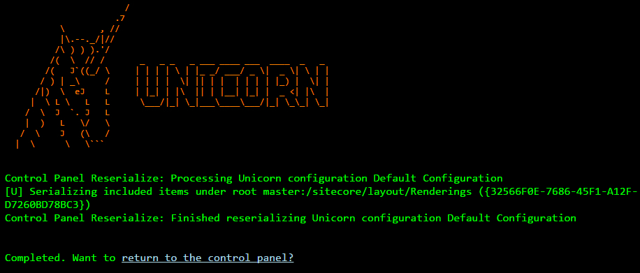
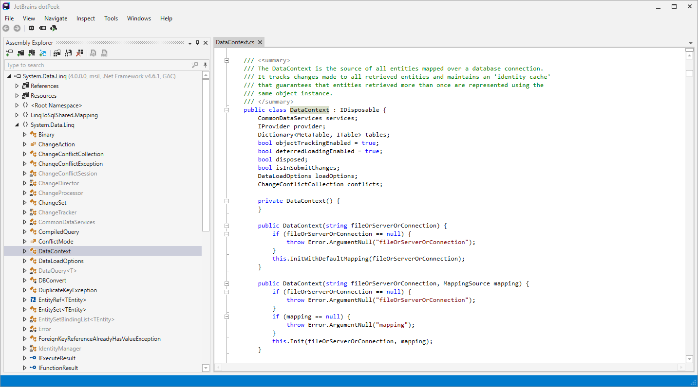
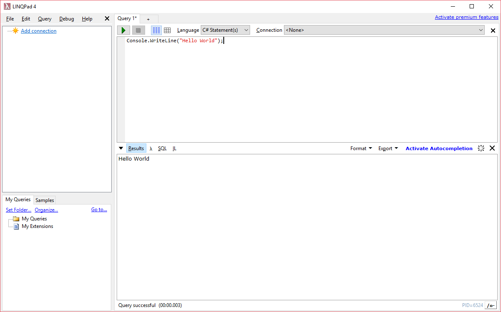

Unicorn

In the past year I have done a fair amount of work using the Sitecore CMS. During this time, I researched various tools and software applications to help make the process of Sitecore development easier and more productive.

<!--more-->

Thanks to one of my teammates I heard about the [Unicorn](https://github.com/kamsar/Unicorn) project, so I decided to take it for a spin. Unicorn is a very handy tool that will allow you to serialize Sitecore items (templates, layouts, etc) to disk. Setting up and using Unicorn is pretty straightforward process.

If you are looking for a lightweight, easy to use tool to achieve Sitecore serialization, Unicorn is a great choice. I still have not had a chance to bring it together with a CI platform like TeamCity, but I am looking forward to that opportunity.

dotPeek

A few months ago I was testing the performance of an application using the RedGate Performance Profiler when I came across [dotPeek](https://www.jetbrains.com/decompiler/) and I am very, very glad I did.

dotPeek is free tool for decompiling .NET code and it has program has saved me a lot of time on multiple occasions. I am a big fan of the ability to generate pdb files and exporting decompiled code to projects for debugging.

I will need to explore dotPeek a bit more to really get more out of it, but so far, it has been very good. Get it, now.

LinqPad

I remember using [LinqPad](https://www.linqpad.net/) sometime in 2009 when I was working on a project using Linq-to-SQL in order to create mappings between classes and SQL tables. For one reason or another I completely forgot its existence, until I rediscovered it a few weeks ago.

I am glad to see that it still provides the same core functionality as in years past, just as it has added a ton of other features.

While there are some utility features, like Autocomplete, that are only for licensed users, the price breakdown seems just right for each of the available tiers, even if you are going for the Premium License.

LinqPad is definitely worth a look if you would like to have a quick and lightweight tool to test code snippets or running Linq queries without loading Visual Studio.
