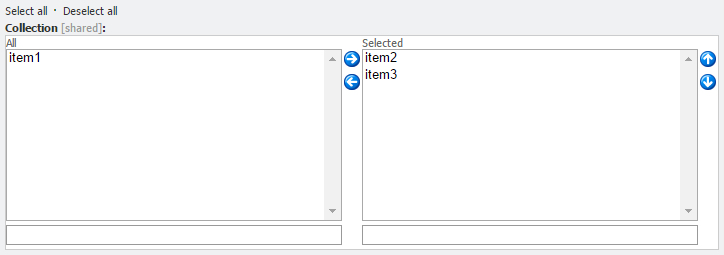

A few weeks ago I needed to write a specific implementation of the type mapper used in Glass.Mapper to handle `IEnumerable<T>` Types. This was necessary because the Sitecore instance I was working with had a customized implementation for handling language fallbacks. This did not play well with the default Glass.Mapper implementation.

I had to come up with a way to modify how Glass.Mapper handles fields that map to an `IEnumerable<T>` type, such as Multilists or Treelists. This is what I did.

<!--more-->

To get started, I needed to create a custom attribute class that would allow me to specify a custom type mapper. The custom attribute could be used like this on type that needed this behavior:

```csharp
public class Model
{
   [CustomIEnumerable]
   public virtual IEnumerable<CollectionItem> Collection { get; set; }
}
```

This custom attribute will map to a field similar to the one shown in this image:



In order to create this custom attribute, it is necessary to inherit from the `SitecoreFieldAttribute` class from the `Glass.Mapper.Sc.Configuration.Attributes` namespace. In this scenario, the Configure method from the `SitecoreFieldAttribute` class must be overridden to setup the Attribute's configuration:

```csharp
public class CustomIEnumerableAttribute : SitecoreFieldAttribute
{
   public CustomIEnumerableAttribute()
      : base() { }

   public CustomIEnumerableAttribute(string fieldName)
      : base(fieldName) { }

   public CustomIEnumerableAttribute(string fieldId, SitecoreFieldType fieldType, string sectionName, bool codeFirst)
      : base(fieldId, fieldType, sectionName, codeFirst) { }

   public override AbstractPropertyConfiguration Configure(PropertyInfo propertyInfo)
   {
      var config = new CustomIEnumerableConfiguration();
      this.Configure(propertyInfo, config);
      return config;
   }
}
```

The Configure method of the class shown above requires an object of type `AbstractPropertyConfiguration`. This means I need to create another class. I will name this class `CustomIEnumerableConfiguration` and it will be derived from the `SitecoreFieldConfiguration` class, which already inherits from the `AbstractPropertyConfiguration` class. This way I can avoid writing a full implementation for the new class, and I only need to override the Copy method:

```csharp
public class CustomIEnumerableConfiguration : SitecoreFieldConfiguration
{
   public override SitecoreFieldConfiguration Copy()
   {
      return new CustomIEnumerableConfiguration
      {
         CodeFirst = this.CodeFirst,
         FieldId = this.FieldId,
         FieldName = this.FieldName,
         FieldSource = this.FieldSource,
         FieldTitle = this.FieldTitle,
         FieldType = this.FieldType,
         IsShared = this.IsShared,
         IsUnversioned = this.IsUnversioned,
         PropertyInfo = this.PropertyInfo,
         ReadOnly = this.ReadOnly,
         SectionName = this.SectionName,
         Setting = this.Setting<
       };
    }
}
```

Once the `CustomIEnumerableConfiguration` class is complete, then the `CustomIEnumerableAttribute` class is completed as well. Now the final piece of the code is the custom type mapper class I need to implement.
For this, I will inherit from the `AbstractSitecoreFieldMapper` class in the `Glass.Mapper.Sc.DataMappers` namespace. This is the base class from which all mappers in Glass.Mapper assembly inherit.

The implementation for the `CustomIEnumerableMapper` class is shown below. For the purpose of this post I have borrowed the implementation from the `SitecoreFieldIEnumerableMapper` class used by Glass.Mapper.
I have only added a couple of lines of code to the new class, in order to demonstrate that the custom mapper is being used:

```csharp
public class CustomIEnumerableMapper : AbstractSitecoreFieldMapper
{
   public override object GetFieldValue(string fieldValue, SitecoreFieldConfiguration config, SitecoreDataMappingContext context)
   {
      Type genericArgument = Glass.Mapper.Utilities.GetGenericArgument(config.PropertyInfo.PropertyType);

      //Write to the Sitecore Log
      Sitecore.Diagnostics.Log.Info(string.Format("Mapping Type: {0}", genericArgument), this);

      IEnumerable<object> enumerable = (IEnumerable<object>)Enumerable.ToArray<object>(
         Enumerable.Select<string, object>(
            (IEnumerable<string>)Enumerable.ToArray<string>(
               Enumerable.Select<string, string>(
                  (IEnumerable<string>)fieldValue.Split(
                     new char[1] { '|' }, StringSplitOptions.RemoveEmptyEntries),
                  (Func<string, string>)(x => x.Replace(Global.PipeEncoding, "|")))),
                  (Func<string, object>)(x => Context.Database.GetItem(new ID(x)))));

      IList list = Glass.Mapper.Sc.Utilities.CreateGenericType(typeof(List<>), new Type[1] { genericArgument }) as IList;

      foreach (object obj in enumerable)
      {
         if (obj != null)
         {
            list.Add(context.Service.CreateType(genericArgument, (Item)obj, false, false, null));
         }
      }

      return (object)list;
   }

   public override string SetFieldValue(object value, SitecoreFieldConfiguration config, SitecoreDataMappingContext context)
   {
      IEnumerable enumerable = value as IEnumerable;

      if (enumerable == null) return (string) null;

      List<string> list = new List<string>();

      foreach (object obj in enumerable)
      {
         string str = this.Mapper.SetFieldValue(obj, config, context);
         if (!ExtensionMethods.IsNullOrEmpty(str))
         {
            list.Add(str);
         }
      }

      Type genericArgument = Glass.Mapper.Utilities.GetGenericArgument(config.PropertyInfo.PropertyType);

      //Write to the Sitecore Log
      Sitecore.Diagnostics.Log.Info(string.Format("Storing Type: {0}", genericArgument), this);

      if (Enumerable.Any<string>((IEnumerable<string>) list))
      {
         return Enumerable.Aggregate<string>((IEnumerable<string>) list, (Func<string, string, string>) ((x, y) => x + "|" + y));
      }

      return (string) null;
   }

   public override bool CanHandle(AbstractPropertyConfiguration configuration, Glass.Mapper.Context context)
   {
      return configuration is CustomIEnumerableConfiguration;
   }
}
```

There are three methods that need to be overridden in order to properly implement our custom `IEnumerable<T>` type mapper:

- GetFieldValue: this method will get the field's value in raw format and convert each of the referenced items to the generic type used in the `IEnumerable<T>`.
- SetFieldValue: this method will take the value of the `IEnumerable<T>` instance and store it in the field.
- CanHandle: defines a condition to determine if the custom mapper can be used. In our scenario there is one rule only, apply the custom mapper if the configuration parameter is of type `CustomIEnumerableConfiguration`.

Once this is completed, it is possible to include the custom type mapper in the CreateResolverMethod of the `GlassMapperScCustom` class:

```csharp
public static IDependencyResolver CreateResolver()
{
   var config = new Glass.Mapper.Sc.Config();
   var container = new Castle.Windsor.WindsorContainer();

   container.Register(
      Component.For<AbstractDataMapper>()
         .ImplementedBy<CustomFieldMapper>().LifestyleTransient(),
      Component.For<AbstractDataMapper>()
         .ImplementedBy<CustomIEnumerableMapper>().LifestyleTransient()
   );

   container.Install(new Glass.Mapper.Sc.CastleWindsor.WindsorSitecoreInstaller(config));

   var resolver = new Glass.Mapper.Sc.CastleWindsor.DependencyResolver(container);

   return resolver;
}
```

Once the code is deployed to a Sitecore instance, we can quickly show that the custom mapper implemented in the `CustomIEnumerableMapper` class is being executed:


As a final note, it is important to point out that this approach will work if you are using Glass.Mapper 4.0 together with the Glass.Mapper.Sc.CastleWindsor 4.0 library in your solution.

Unfortunately, I have not been able to test this functionality in Glass.Mapper.Sc 4.0 using a different IoC container. However, the code provided here serves as a good starting point for anyone trying to achieve a similar result.
