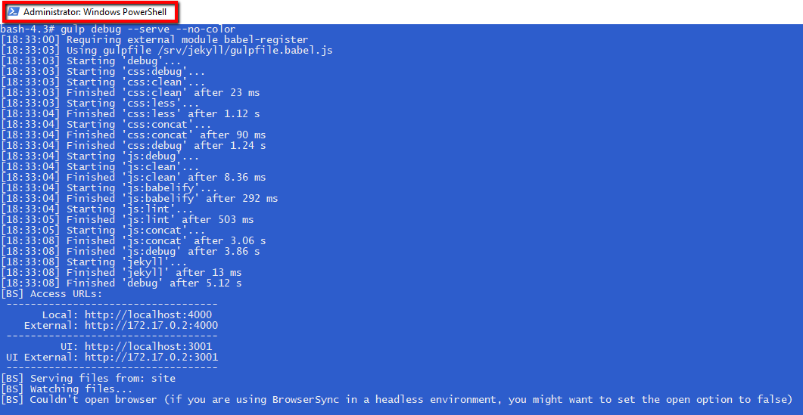

Docker has been on my TODO list for a long time. I took it for a spin briefly a few months ago, but I had not had the opportunity to use it on something specific.

I chose to use my own website to build a custom Dockerfile for local development, this way I could get up and running quickly on any of my 3 machines (Windows 10, Mac, Linux) without worrying about keeping Jekyll up to date, especially on Windows.

I followed the instructions from the [Docker website](https://docs.docker.com/engine/getstarted/step_four/#step-1-write-a-dockerfile) in order to write a custom Dockerfile. The first thing I had to do was to create a new file with the name <code>Dockerfile</code>. To begin, I included this line:

<pre>
#Dockerfile

FROM jekyll/jekyll:latest
</pre>

That was an easy start! The first line in the Dockerfile guarantees that the Docker image will be created with the latest version of the Jekyll Docker image. Using the [Jekyll Docker wiki](https://github.com/jekyll/docker/wiki/Usage:-Running), I built my local image from the terminal, running the command from the path where the Dockerfile is located:


> docker build . -t jekyll-website


This command creates a Docker image with the tag "jekyll-website". Note you do not have to specify the name of the file as long as it is named "Dockerfile". I can use the tag to refer to the custom image in order to create a container later:


> docker run --name=website --label=jekyll --volume=/path/to/code:/srv/jekyll -it --publish 127.0.0.1:4000:4000 jekyll-website /bin/bash


This command creates and runs a container with the name <em>website</em>. Using the volume mapping option: <code>--volume</code>, I can make the contents of the path at <code>/path/to/code</code> available to the container locally. In this way, the container will have access to the files needed to build the website.

Using the publish option: <code>--publish</code>, I will be able to access the pages by visiting http://localhost:4000/, because it maps my system's port 4000 to the container's published port 4000.

By adding <code>/bin/bash</code> at the end of the command, I will have access to the container's shell once it is running. This will allow me to run commands, like <code>npm install</code> or <code>jekyll serve</code>.

Unfortunately, after creating and starting the container, I ran into my first problem quite quickly:

I needed to include the pygments highlighter as a dependency using a Gemfile. I do not recall having to do this the first time I started using Jekyll. A quick search gave me the [reason](https://jekyllrb.com/docs/upgrading/2-to-3/#syntax-highlighter-changed).

I added pygments into the Gemfile and then, I realized I was missing more dependencies. Good thing I had decided to do this. I created the Gemfile with the missing dependencies:

<pre>
#Gemfile

source 'https://rubygems.org'
gem 'jekyll'
gem 'jekyll-paginate', group: :jekyll_plugins
gem 'kramdown', group: :jekyll_plugins
gem 'pygments.rb', group: :jekyll_plugins
</pre>

This time Docker ran successfully, and I was able to trigger the <code>jekyll serve</code> command from the container's shell:

My personal setup just needs one additional step to run. I have to install the gulp-cli npm package as a global package in the container. The default Jeyll container already includes node v6.9.2, so it was only a matter of including a new command:

<pre>
#Dockerfile

FROM jekyll/jekyll:latest

RUN npm install -g gulp-cli
</pre>

After adding this new step, I needed to rebuild the Docker image and the container. I got rid of the previous image by first stopping the container:


> docker stop website


Then, I deleted the container and the local image:


> docker container rm website

> docker image rm jekyll-website


I rebuilt my new custom image as a container using the initial <a href="#build">build command</a> and then, <a href="#run">ran the container</a>. On the terminal prompt I entered the gulp command to build and serve the development version of the site:

That was enough to get my site running on a local container. The next test would make sure I could start the container on my Windows machine and host the Jekyll site. I pushed my changes to the Dockerfile to the repository, built the image on the Windows machine, and ran the container using the same steps described earlier:

Now, this is a very simple setup that you can use to get your local jekyll environment up and running in a few minutes using Docker.
